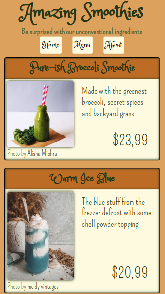

# Restaurant Page

## Project assing from [TheOdinProject](https://www.theodinproject.com/lessons/node-path-javascript-restaurant-page)

A restaurant page with three tabs generated by JS. The photos came from [Pexels](https://www.pexels.com), and the clipart from [creazilla](https://creazilla.com/).

 
